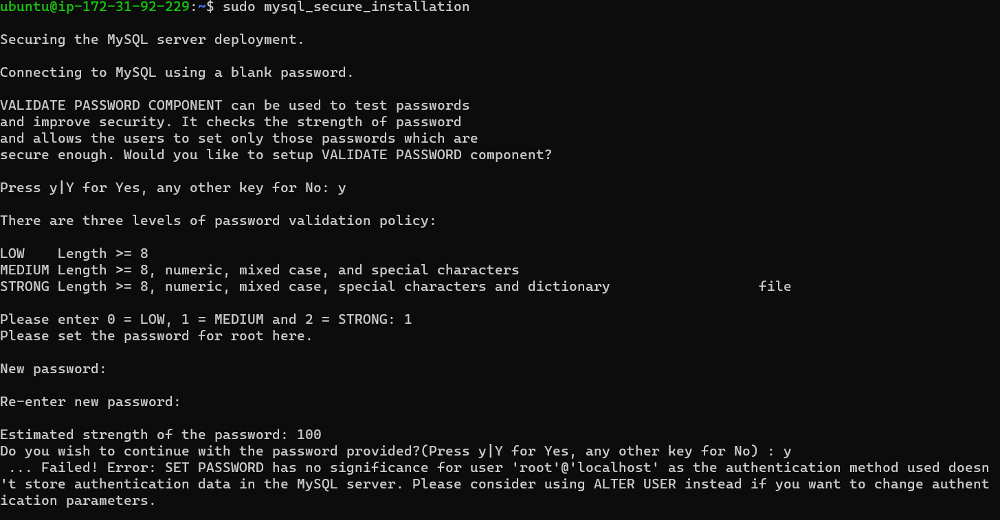

## Awesome Documentation of Project-1

**INSTALLING APACHE AND UPDATING THE FIREWALL**

`sudo apt update`

`sudo apt install apache2`

`sudo systemctl status apache2` > To verify that apache is running on our server


**INSTALLING MYSQL**

`sudo apt install mysql-server`

`sudo mysql` 


`sudo mysql_secure_installation`



`sudo mysql -p`


**INSTALLING PHP**

`sudo apt install php libapache2-mod-php php-mysql` > To install php, libapache2-mod-php and php-mysql

`php -p`


`sudo mkdir /var/www/projectlamp`

`sudo chown -R $USER:$USER /var/www/projectlamp`

`sudo vi /etc/apache2/sites-available/projectlamp.conf`

```
 <VirtualHost *:80>
ServerName projectlampServerAlias www.projectlampServerAdmin webmaster@localhostDocumentRoot /var/www/projectlampErrorLog ${APACHE_LOG_DIR}/error.logCustomLog ${APACHE_LOG_DIR}/access.log combined</VirtualHost>
```
`sudo ls /etc/apache2/sites-available`

`sudo a2ensite projectlamp`

`sudo a2dissite 000-default`

`sudo apache2ctl configtest` > Syntax OK

`sudo systemctl reload apache2`

`touch /var/www/projectlamp/index.html`

`sudo echo 'Hello LAMP from hostname' $(curl -s http://169.254.169.254/latest/meta-data/public-hostname) 'with public IP' $(curl -s http://169.254.169.254/latest/meta-data/public-ipv4) > /var/www/projectlamp/index.html`

**ENABLE PHP**

`sudo vim /etc/apache2/mods-enabled/dir.conf`

```
<IfModule mod_dir.c>
#DirectoryIndex index.html index.cgi index.pl index.php index.xhtml index.htm
DirectoryIndex index.php index.html index.cgi index.pl index.xhtml index.htm
</IfModule>
```
`sudo systemctl reload apache2`

`touch /var/www/projectlamp/index.php`

`vim /var/www/projectlamp/index.php`
```
<?php
phpinfo();
```


`sudo rm /var/www/projectlamp/index.php`